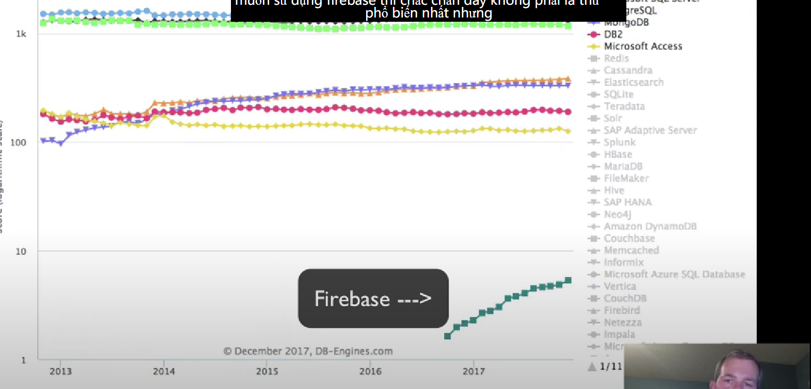

# 1. Giới thiệu

1. ĐN: FireBase:
   1. Là 1 cộng cụ gg có thể giúp ta gọi ra realtime database
   2. CHo phép sử dụng xác thực của GG.
   3. GG lưu trữ giúp ta.
2. Realtime Database
   1. Dự vào Cloud để lưu trữ
   2. Tự động cập nhật dữ liệu vào web app của bn
3. Storage:
   1. Giống 1 cơ sở dữ liệu
   2. Phải trả tiền nếu muốn sử dụng nhiều
4. Dữ liệu:
   1. Là 1 đối tượng Json lớn
   2. Trong cơ sở dữ liệu tr thống, ta sẽ học về các Bảng, truy xuất dữ liệu bảng
   3. Nhưng ở đây, với FireBase, ta sẽ học theo 1 cách khác
   4. Không phải là cái phổ biến nhất(nhìn nó ở tít cuối kìa :vv):  
      1. 
      2. Nhưng nó đg phát triển ....