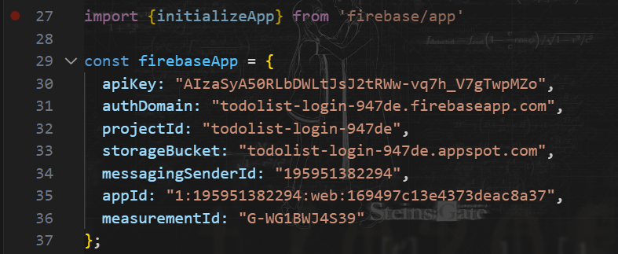
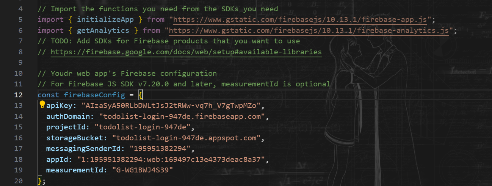
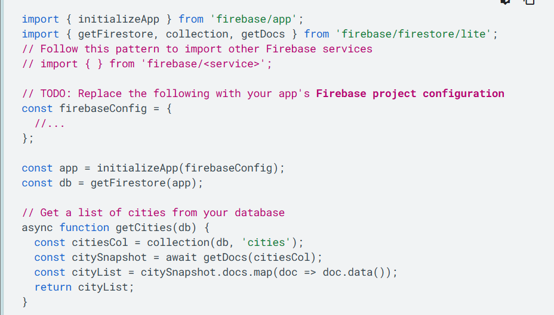

# Các bước thực hiện:


1. Bước 1: Tạo dự án Firebase và đăng ký ứng dụng
2. Bước 2: Cài đặt SDK và khởi chạy Firebase:
   1. cài npm: npm init
   2. cài firebase: npm i firebase
   3. Khởi chạy Firebase trong ứng dụng của bạn và tạo đối tượng Ứng dụng Firebase:
      1. 
         1. Ứng dụng Firebase là một đối tượng giống như vùng chứa có chức năng lưu trữ thông tin cấu hình phổ biến và chia sẻ tính năng xác thực trên các dịch vụ Firebase. Sau khi bạn khởi chạy một đối tượng Ứng dụng Firebase trong mã của mình, bạn có thể thêm và bắt đầu sử dụng Firebase luôn miễn phí.
         2. Nếu ứng dụng của bạn có các tính năng động dựa trên tính năng kết xuất phía máy chủ (SSR), bạn sẽ cần thực hiện một số bước bổ sung để đảm bảo rằng cấu hình của mình vẫn tồn tại trên các lượt kết xuất hình ảnh trên máy chủ và lượt kết xuất ứng dụng. Ngang bằng logic máy chủ của bạn, hãy triển khai Giao diện FirebaseServerApp sang tối ưu hoá ứng dụng của bạn quản lý phiên bằng trình chạy dịch vụ.
      2. Nếu muốn xài online => nhúng script: 
         1. 
3. Bước 3: Truy cập vào Firebase trong ứng dụng của bạn
   1. Các dịch vụ của Firebase (như Cloud Firestore, Authentication, Realtime Database, Remote Config và nhiều định dạng khác) có sẵn để nhập trong từng tài khoản các package con.
   2. Ví dụ bên dưới cho thấy cách bạn có thể sử dụng SDK Lite Cloud Firestore để truy xuất danh sách dữ liệu.
      1. 
      2. Truy cập vào từng gói con: import cái hàm từ gói(dịch vụ) ấy ra `import { } from 'firebase/<service>';`
4. B4: Sử dụng bộ gói mô-đun (webpack/Rollup) để giảm kích thước
   1. Bây giờ, bạn đã thiết lập xong để sử dụng Firebase, bạn có thể bắt đầu thêm và sử dụng bất kỳ sau đây các dịch vụ Firebase có sẵn trong ứng dụng web của bạn.
   2. Các lệnh sau cho biết cách nhập thư viện Firebase được cài đặt cục bộ cùng với npm. Để biết các tuỳ chọn nhập thay thế, hãy xem tài liệu về thư viện có sẵn.
   3. Analytics for Web
   ```js
      import { } from 'firebase/analytics';
      Authentication for Web
      import { } from 'firebase/auth';
      Cloud Firestore for Web
      import { } from 'firebase/firestore';
      Cloud Functions for Web
      import { } from 'firebase/functions';
      Cloud Messaging for Web
      import { } from 'firebase/messaging';
      Cloud Storage for Web
      import { } from 'firebase/storage';
      Performance Monitoring for Web
      import { } from 'firebase/performance';
      Realtime Database for Web
      import { } from 'firebase/database';
      Remote Config for Web
      import { } from 'firebase/remote-config';
      App Check for Web
      import { } from 'firebase/app-check';
      Vertex AI in Firebase for Web
      import { } from 'firebase/vertexai-preview';
   ```