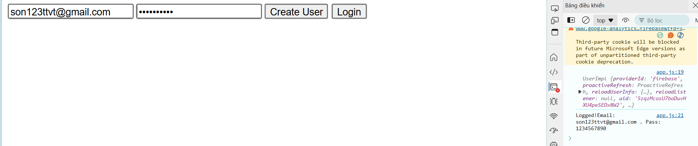
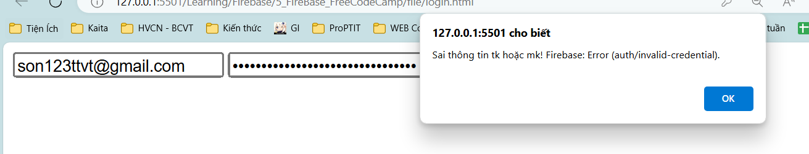
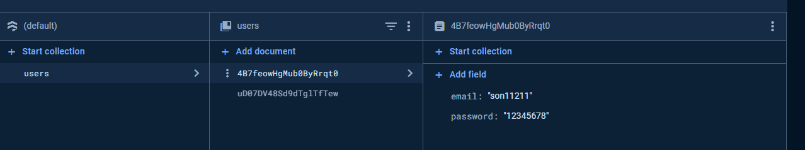

# I. Authentication:
1. Tạo dự án Firebase:
   1. Tạo trên Firebase
   2. Import hàm lấy fire-base config:
      1. 
2. Kích hoạt Authentication
   1. Kích hoạt trên Firebase:
   2. Import hàm getAuth, lấy ra cái auth. Tiếp theo là custom các hàm liên quan đến createUser hoặc là signin
      1. `import { getAuth, createUserWithEmailAndPassword, signInWithEmailAndPassword, onAuthStateChanged} from "https://www.gstatic.com/firebasejs/10.13.1/firebase-auth.js";`   
      2. 
      3. 
   3. Ví dụ ta có 1 form đăng kí, chỉ cần nhập email, pass là oke:
      1. 
      2. 
      3. Ta cứ tạo event, lấy ra value của 2 cái input, và đẩy vô hàm đã tạo:
         1. 
         2. Test chức năng đăng kí:
            1. 
            2. 
            3. Nếu đăng kí 1 email đã dùng rồi, nó sẽ xuất ra:
               1. 
         3. Test chức năng đăng nhập:
            1. 
            2. Nếu tk đc tạo rồi, thì sẽ in: 
               1. 
            3. Nếu chưa đc tạo hoặc sai tt:
               1. 
3. Sign in with Google:
   1. B1: Thêm 1 phương thức xác thực bằng gg, sử dụng email của bn để add vào
   2. B2: import Class GoogleAuthProvider và các pthuc liên quan(mở Popup đăng nhập bằng tk gg) vào: (Cùng package firebase-auth)
      1. 
      2. 
      3. 
   3. Lưu ý: Cái GG này nó cần có domain của web để làm việc, nếu ko sẽ có lỗi ntn: 
      1. 
   4. Sửa: Thêm domain:
      1. 
      2. Ấn Add Domain (nhưng phải có thì mới add :vvv)
4. Sign in with Github

# II. FireStore Database:
1. B1: Create Firestore trong FireBase:
2. B2: Gọi phương thức getFireStore, và các phương thức liên quan trong package firestore:
   1. `import { getFirestore} from "https://www.gstatic.com/firebasejs/10.13.1/firebase-firestore.js";`
   2. Tạo biến database: `export const database = getFirestore(app); console.log(database)`
   3. Gọi các phương thức để add data, biến trả về 1 trường dữ liệu, lấy ra dữ liệu:
      1. `import { collection, addDoc} from "https://www.gstatic.com/firebasejs/10.13.1/firebase-firestore.js";`
   4. Bắt đầu custom:
      1. Vd: Ta muốn lấy cái email, password để đẩy vô database trong trường "users"
      2. 
      3. Tạo 1 button, để tạo sk lấy giá trị:
      4. 
      5. 
   5. Kết quả:
      1. 
      2. Ktra trên firebase:
      3. 
      4. Muốn thêm nữa thì:
         1. 
3. Get Data:
   1. 
   2. Nhớ import thêm getDocs
   3. Nếu muốn get liên tục theo Firebase Realtime thì sử dụng hàm onSnapShot
4. Update Data:
   1. ĐK: Cần có ID của data, có thể xem ở FIrebase. Nếu muốn sd nhiều thì tạo mảng rồi lưu đtg, cần thì ra id của nó.
   2. Nhớ import thêm updateDoc, doc
   3. 
5. Delete Data:
   1. ĐK: Cần có ID của data, có thể xem ở FIrebase. Nếu muốn sd nhiều thì tạo mảng rồi lưu đtg, cần thì ra id của nó.
   2. Nhớ import thêm deleteDoc, doc
   3. 
   4. 

# III. Firebase Storage:
1. Upload File:
   1. import các biến, hàm lquan
      1. getStorage => Trả về storage
      2. ref: tạo các đường dẫn lưu trữ
      3. uploadBytesResumable: Hàm này giúp khởi tạo 1 hàm quá trình upload (có thể đặt tên là uploadTask)
      4. getDownloadURL 
   2. Code:
      1. 
      2. Tạo btn, input để nhập file và submit:
         1. 
         2. 
   3. kết quả: 
      1. 
      2. 
# IV. Realtime:
- Lấy ra dữ liệu thay đổi theo thời gian thực bằng onSnapshot trong package Firestore

# V. Firebase Firestore Queries:
- Là truy vấn đến các giá trị tronng Firestore