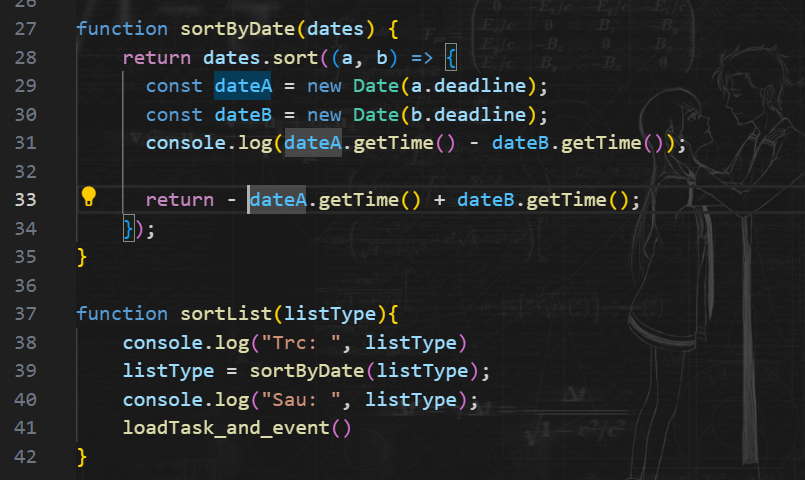

1. Sort theo thời gian:
   1. Ta convert String lưu thời gian về 1 OBJ Date
   2. Dùng hàm sort => return là Date.getTime(chuyển sang mili giây)
   3. 
2. Tạo thẻ:
   1. Nên set ID để cho dễ CSS, tìm thẻ
   2. Mỗi lần tạo các thẻ mới (VD: Task, thẻ nhập Task), ta phải set lại các event cho các nút trên nó.
   3. Check xem 1 tk con có trong tk cha hay ko: `tagA.contains(tagB)`
