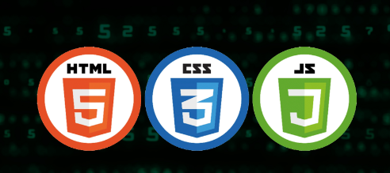
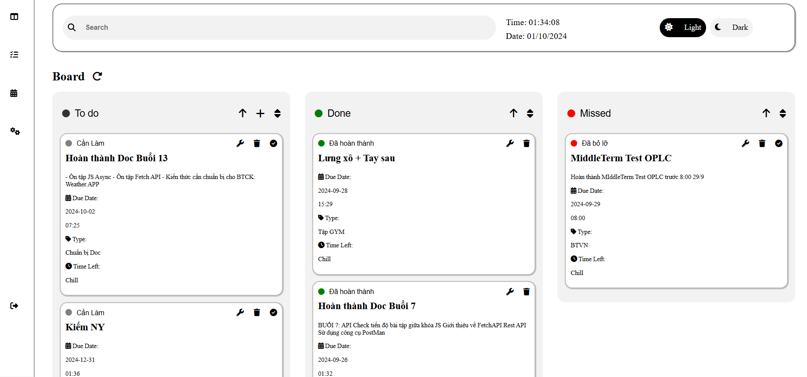
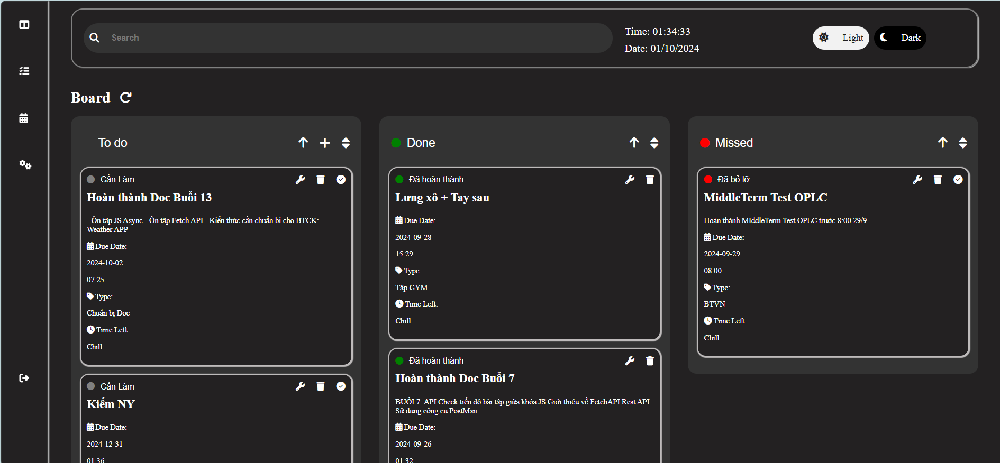
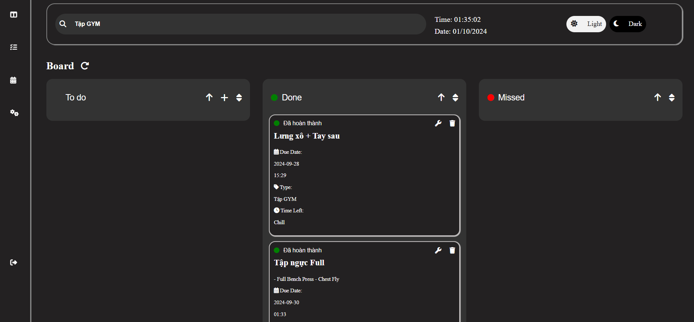

# I. Giới thiệu dự án

- Tên: TODOLIST
- Mô tả: Là dự án giữa khóa học JS của CLB Lập trình PTIT. Web có tác dụng giúp người dùng tạo và quản lý các task của mình 1 cách hiệu quả.

# II. Demo dự án:
- `https://todolist-proptit-8dvbuy0ir-kaitas-projects-8183879f.vercel.app/`

# IV. Các công nghệ sử dụng:

- HTML, CSS, JS cơ bản
  - 
- Lưu trữ dữ liệu trên FireBase (Firestore):
  - 

# IV. 1 số hình ảnh về dự án:
- 
- 
- 
- 
- 

# V. Điều muốn cải tiến trong tương lai:
- Tạo và quản lý task cho từng user.
- Tối ưu các chức năng của Web

